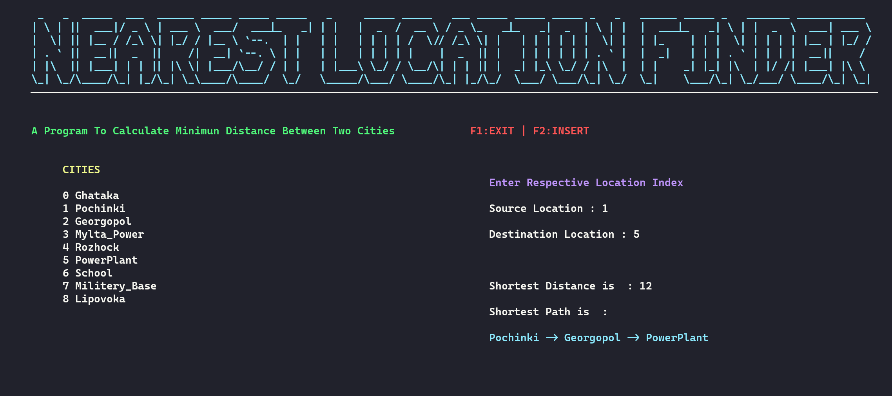

# Find Nearest Location 
---
# Description
This Project uses the Dijkshtras Algorithm To Find Out The Shortest Distance Between Two Cities And The Path For The Same. 
In Addition To This We Have Used The  `ncurses` Library To Make It Little Fun Project

# Installation 
---
### Requirments 
 - Any Linux Distribution (I had some problem with debian / Working Perfectly on Arch ).
 - `libncurses` Library ( Check Below For Installation).

### Installing ncurses Library 
 - Debian <br/> 
   Updating package list
   ```sh
   apt update
   ```
   Installing ncurses
   ```sh
   apt install libncurses6 libncursesw6
   ```
- Arch <br/>
    Updating Package List
    ```sh
    pacman -Syy
    ```
    Installing ncurses
    ```sh
    pacman -S ncurses
    ```
### Compiling With ncurses
```sh
g++ -lncurses ncurses.cpp -o ncurses
```

# Visuals


# Issues
 - This Algorithm Fails In Some Test Cases ( For Sample Input Failed Case is 0-2)
 
# RoadMap
 - Make Program More Flexible 
 - Work On ncurses to make program more user friendly
 - May be Shifting to another algorithm or change current one to make program more accurate

# Contributing 
 The Contribution are open for this program this program has lots of area of improvements so i would be happy to accept your contributions for this program.
 Even if you are new to ncurses or dont want to work with it, you can always contribute in other parts of Program.


